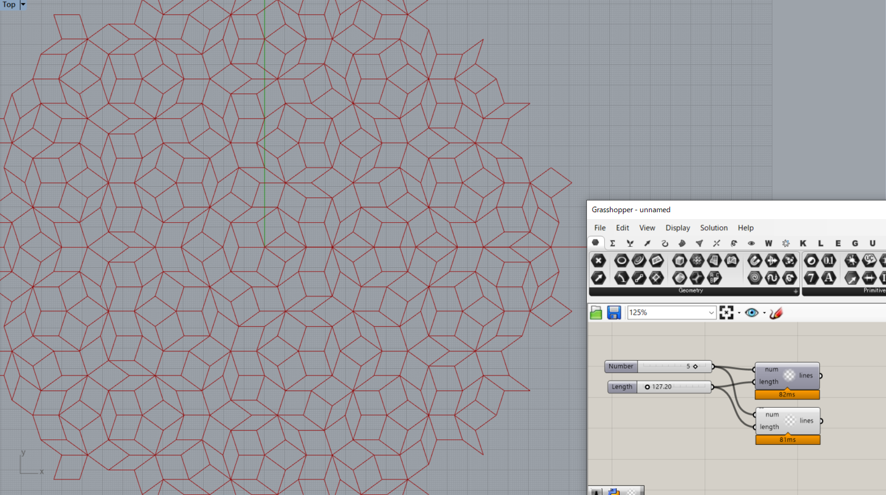

# GH_PenroseTiling
### Penrose diagram lines Grasshopper component for practice
test sample : Standard and multi-threading

---
#### References  
Rajaa Issa Robert McNeel & Associates,
"Essential Guide to C# Scripting for Grasshopper" 